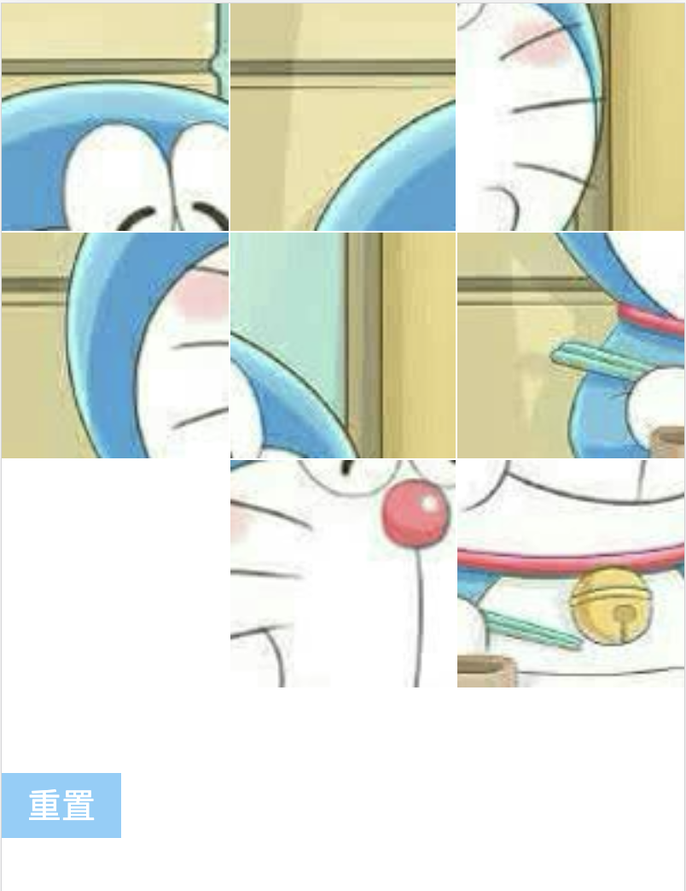

# GridView

利用 Grid 布局实现的九宫格小游戏

## Command

```bash
  $ npm install
  $ npm start
```

## Introduce

利用 Grid 布局来实现九宫格小游戏，通过`grid-template-areas`来实现区域的分布，子元素通过`grid-area`属性来对应其所在的位置，这样就非常方便的就能实现任意宫格布局。

```css
.wrapper {
  display: block;
  grid-template-rows: repeat(3, 1fr);
  grid-template-columns: repeat(3, 1fr);
  grid-template-areas:
    "block01 block02 block03"
    "block04 . block05"
    "block06 block07 block08";
}
.block01 {
  grid-area: block01;
}
```

## Api

### options

- frames: 格子数量
- cover: 底图
- size: 网格大小
- onSuccess: 游戏成功后回调

### func

- init: 初始化布局
- reset: 重置布局

## Usage

```js
import GridView from "./GridView";

const gird = new GridView("#gridView", {
  frames: 3,
  cover:
    "https://github.com/zprial/Blackbox/blob/master/packages/GridView/src/demo.png?raw=true",
  onSuccess() {
    alert("Great, you succeed!");
  }
});

gird.init();

document.getElementById("reset").addEventListener("click", function() {
  gird.reset();
});
```

## Preview
